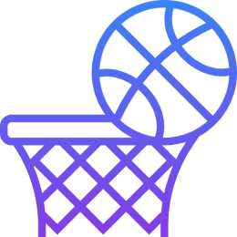
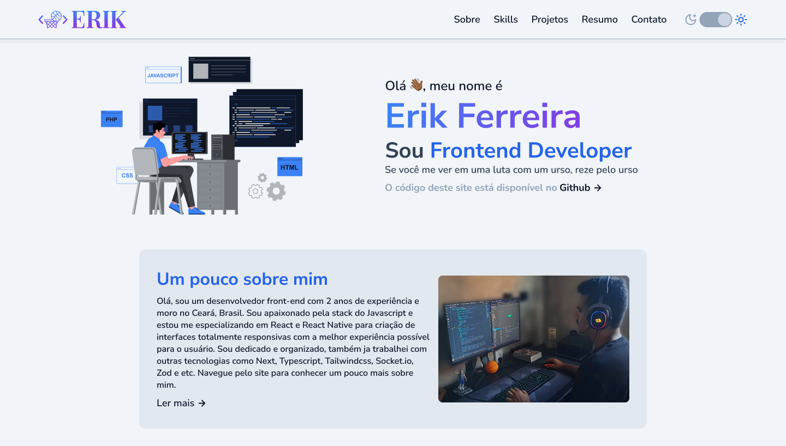

# Portfólio 

 

  
  

 

## :computer: Projeto

Este é meu portfólio, criado com dois objetivos: o primeiro, mostrar um pouco mais dos meus projetos; e o segundo, treinar minhas habilidades tanto no Figma quanto no código. Inicialmente, construí o layout de todo o projeto no modo dark, depois apliquei a responsividade em todas as telas e, por fim, criei o modo light.

## :rocket: Tecnologias

- [Next.js](https://nextjs.org)
- [Typescript](https://www.typescriptlang.org)
- [TailwindCSS](tailwindcss.com)
- [React Hook Form](react-hook-form.com)
- [Zod](https://zod.dev)
- [React Player](https://github.com/cookpete/react-player)
- [SwiperJS](https://swiperjs.com)
- [Google Fonts](https://fonts.google.com)

## :thinking: Como rodar o projeto?

1. `npm i` ou `yarn` para instalar as dependências

2. `npm run dev` ou `yarn dev` para rodar o projeto que vai ficar executando no endereço [http://localhost:3000](http://localhost:3000)
